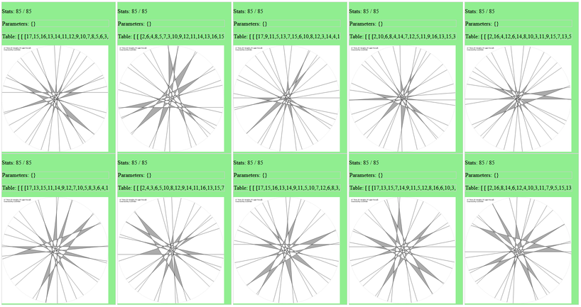

# KobonCNF

By utilizing a CNF model of the Kobon triangle problem, Kissat for solving SAT problems, and LineOrder for fitting straight lines, this tool helps in discovering new optimal arrangements.

## Showcases

- [Gallery #1](https://zegalur.github.io/line-order/gallery/kobon.html) – New optimal solutions to the Kobon triangle problem (`n = 23` and `n = 27` found using this approach).

## Prerequisites

- The [Kissat](https://github.com/arminbiere/kissat) SAT solver must be installed and accessible via the `kissat` command in the terminal.
- The [LineOrder](https://github.com/zegalur/line-order) repository should be copied to the parent directory.

## Tools

- `gen.py` – Generates optimal pseudo-line arrangement tables.
- `fit.py` – Uses tables generated by `gen.py` to find the best corresponding straight-line arrangements.

Run `gen.py` or `fit.py` without arguments to view detailed help information.

For example, to generate every single `n=17` Kobon arrangement, use (`python` or `python3`, `-U` for unique only):
```
python gen.py 17
python fit.py 17 -U
```
Then open the `<kobon-cnf>/fit/kobon-17.html` to see the results gallery:


## How It Works

The tool converts the problem into a SAT-problem that is solvable by state-of-the-art SAT solvers.  
For details on the CNF model, refer to the comments and output in the `koboncnf.py` file.

## Limitations

This approach works best when `N mod 6 = 3` or `5` (especially with symmetries enabled).  
For other values of `N`, consider using the missing triangles option: `-L ...`.

## Acknowledgments

This project makes use of the [Kissat](https://github.com/arminbiere/kissat) SAT solver and the [LineOrder](https://github.com/zegalur/line-order) library. Written in Python.

## References

- [Kobon Triangle Problem – Wikipedia](https://en.wikipedia.org/wiki/Kobon_triangle_problem)
- [The Kissat SAT Solver](https://github.com/arminbiere/kissat)
- [LineOrder Library](https://github.com/zegalur/line-order)

## License

This work is licensed under [CC BY 4.0](https://creativecommons.org/licenses/by/4.0/)  
*Pavlo Savchuk, 2025*

